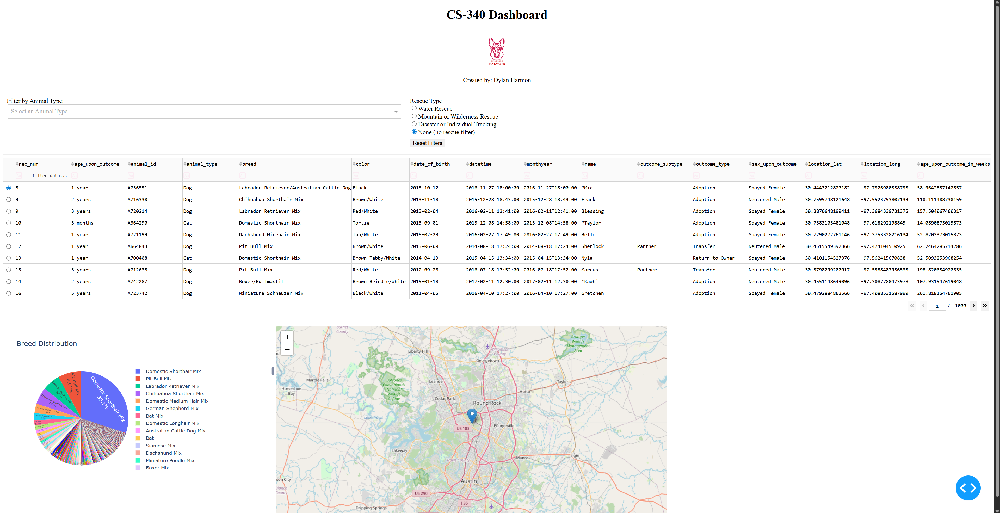
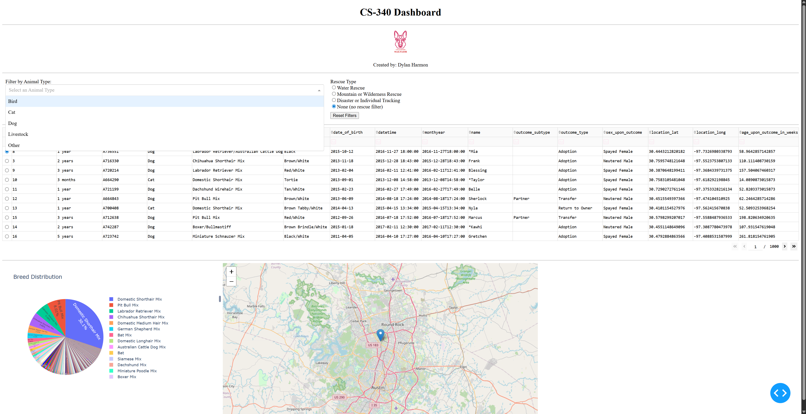
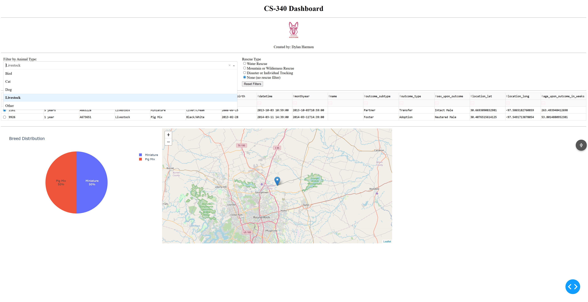
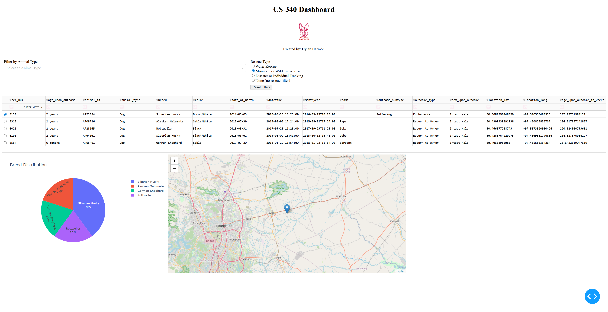
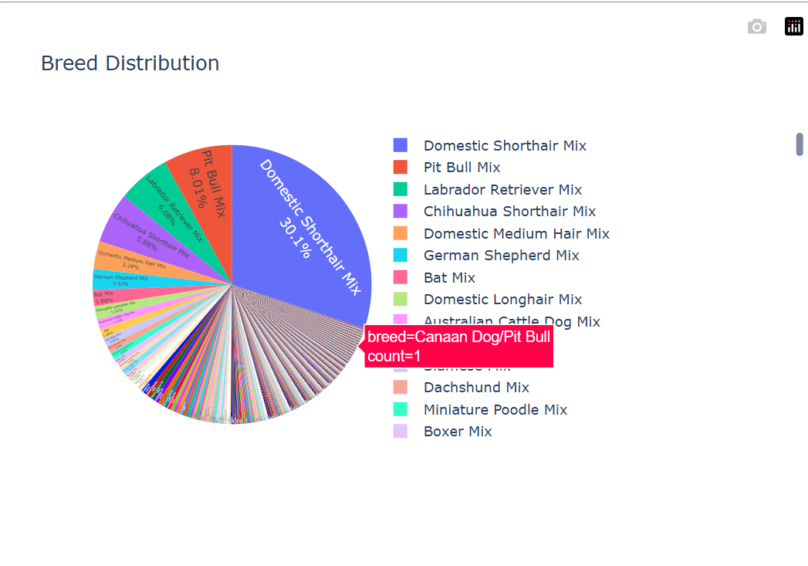

README (Project Two):

ProjectTwo includes the following files:

	- ProjectTwoDashboard.ipynb
	- CRUD_Python_Module.py
	- GS_Logo.png

Functionality

MongoDB Functionality (Project Two)

Evolving Data
MongoDB doesn’t force a rigid schema; documents in the same collection can diverge wildly. New fields can appear in some records and not others. This is a boon when your data model is in flux — when attributes are optional, nested, or constantly changing — or when you’re ingesting heterogeneous sources. You avoid nonstop migrations and can pivot the model quickly, with minimal friction.

Rich Querying and Aggregation
MongoDB delivers more than simple lookups. With expressive query operators, indexes, and a powerful aggregation pipeline, you can filter, group, transform, and compute complex projections server-side. That means heavy lifting — aggregation, joins-like $lookup, computed fields — can happen in the database, cutting network chatter and often improving throughput and latency.

Interfacing with Python: Drivers and Tooling
MongoDB’s Python ecosystem is mature and practical. A few highlights:

- PyMongo — the official, low-level driver. It maps BSON to Python dict-like objects and exposes CRUD, indexing, aggregation pipelines, transactions, and change streams. Example: `db.collection.find_one({"_id": id})` returns a document you can manipulate as a Python dict.

- Native mapping to Python types simplifies serialization and deserialization.

- Robust sync and async drivers support different concurrency models.

- ODMs (object-document mappers) offer class-based schemas, validation, and developer ergonomics when you want stronger structure.

- Server-side features such as aggregation, transactions, and change streams are accessible from Python, making advanced patterns feasible without reinventing logic in application code.

- Strong community support, stable documentation, and monitoring tools round out the ecosystem.

When to Consider Alternatives
MongoDB shines for flexible schemas and document-centric models. But if your domain demands heavy, normalized relational integrity across many tables, intricate foreign-key constraints, or lots of tightly-coupled multi-row transactions, a relational DB (PostgreSQL, etc.) is often a better fit.

Project Steps — What I Did and Why

Data access & preprocessing
- Imported the CRUD module and instantiated `AnimalShelter` with credentials.  

- Queried the collection with `db.read({})` and loaded results into a pandas DataFrame.  

- Dropped MongoDB’s `_id` (ObjectID) column to avoid serialization/DataTable issues.  

- Inspected columns and values, handled missing entries and data types so downstream components wouldn’t fail.

App layout construction
- Built the UI skeleton: header, base64-embedded logo, and clear spacing for readability.  

- Added filter controls: a `Dropdown` for `animal_type` and `RadioItems` for quick selections.  

- Created a feature-rich `DataTable` with paging, sorting, native filtering, and single-row selection.  

- Partitioned the main view into two containers: `graph-id` for visuals and `map-id` for geospatial detail.

Challenges and how they were resolved
- Filter precedence confusion: I originally reused filters from prior projects and inadvertently made the Animal Type filter dominate. That prevented the rescue filter and others from combining properly. The fix was to compute an effective filter value (quick-select overrides only when meaningful; otherwise the dropdown applies) and send that as the query to the DB — ensuring multiple filters cohere rather than clash.

- Chart wiring pains: connecting filters and the DataTable to charts required careful propagation of `derived_virtual_data` so graphs reflect the table’s current virtual dataset. Once the flow was corrected, charts updated reliably.

- Pie chart styling: Plotly’s pie options are deep and subtle. The chart looked untidy until I adjusted labeling, slice grouping, and layout parameters — after a focused study session I tuned the visual defaults and improved readability.

- Tooling friction: the biggest friction point was environment switching. I began in another IDE and used Jupyter primarily for testing; that caused context switching and integration headaches. Moving development into JupyterDash and running the server inline streamlined iteration and debugging.

Overall, the project progressed in clear stages: data ingestion and cleaning; layout and component assembly; callback wiring and state management; visualization refinement; and iterative debugging. Each challenge tightened the app’s robustness — from fault-tolerant data handling to responsive, filter-aware visualizations.
